# Processing Python Mode: Creative Coding Made Easy

*The official source code for the examples, as well as solutions to challenges, for the book **Processing Python Mode: Creative Coding Made Easy***

Navigate through the directories listed above to find the code for the images displayed below.

## Chapter 0: Introduction

<a href="chapter-0-introduction/digital_aquatics">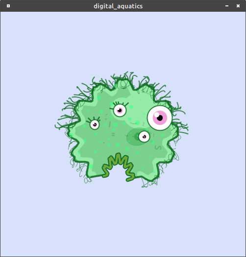</a>

## Chapter 1: Hello, World!

 <a href="chapter-1-hello,_world!/primitives_2d">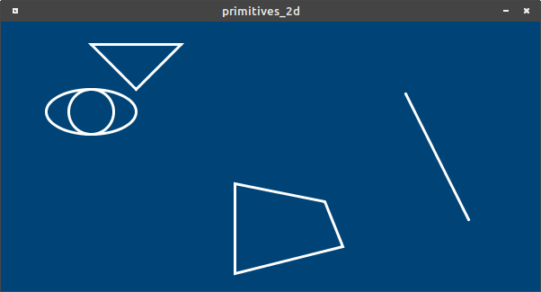</a> <a href="chapter-1-hello,_world!/rainbow">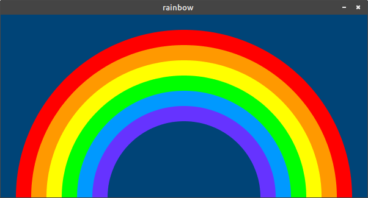</a> <a href="chapter-1-hello,_world!/variables">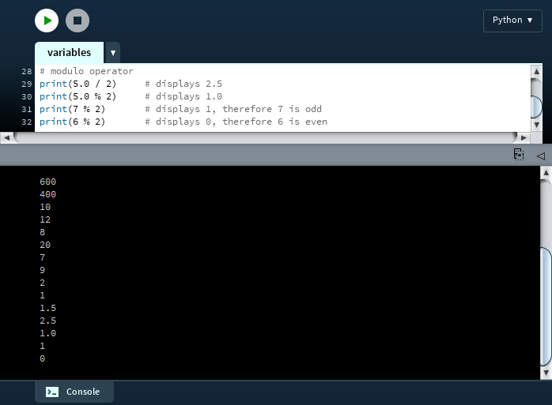</a> <a href="chapter-1-hello,_world!/disk_space_analyzer">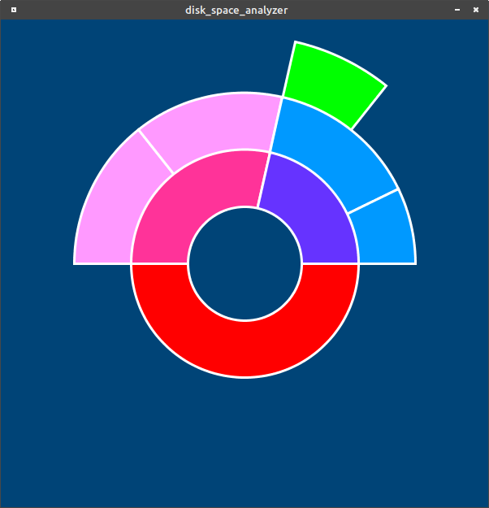</a>

## Chapter 2: Drawing More Complicated Shapes

 <a href="chapter-2-drawing_more_complicated_shapes/vertices">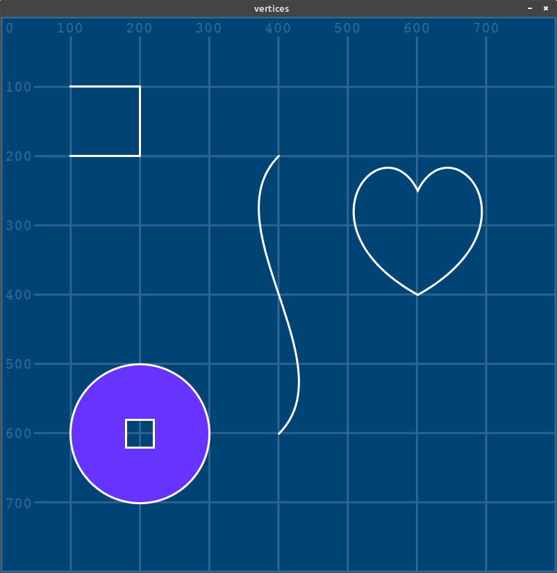</a> <a href="chapter-2-drawing_more_complicated_shapes/python_logo">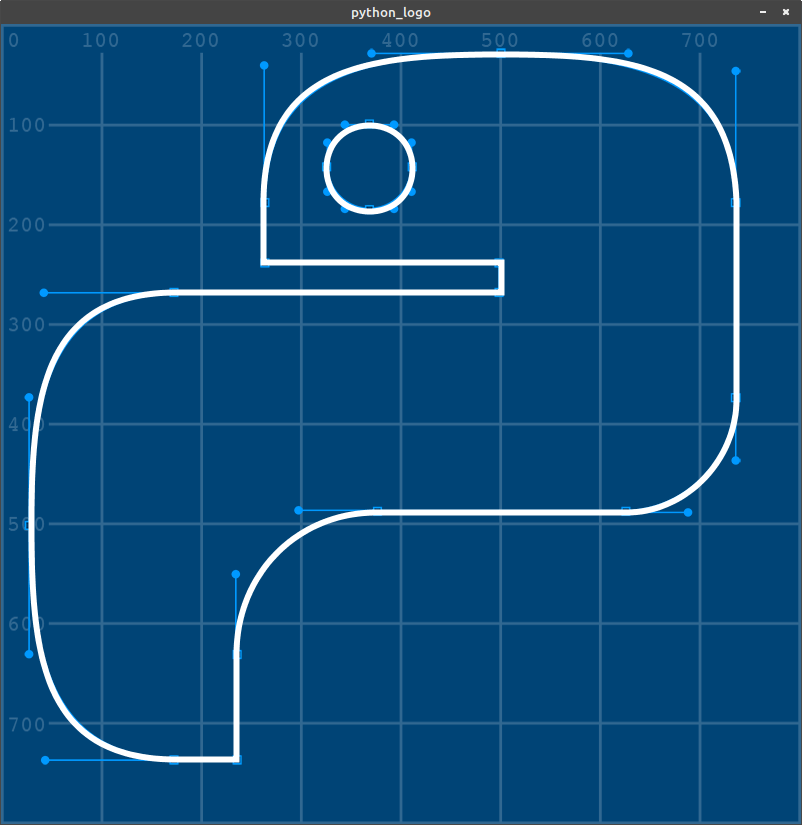</a>

## Chapter 3: Text

<a href="chapter-3-text/strings">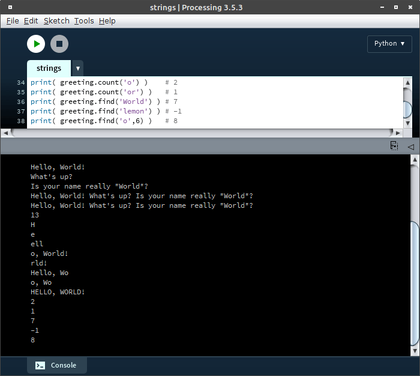</a> <a href="chapter-3-text/typography">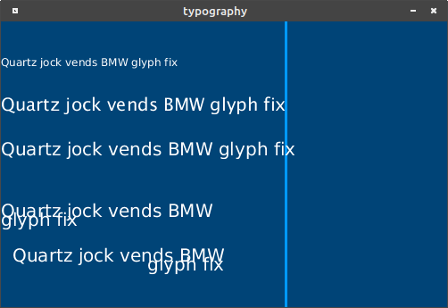</a>

## Chapter 4: Conditional Statements

<a href="chapter-4-conditional_statements/conditional_statements">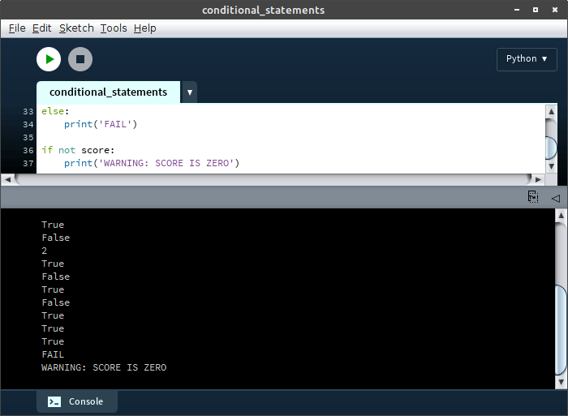</a> <a href="chapter-4-conditional_statements/four_square">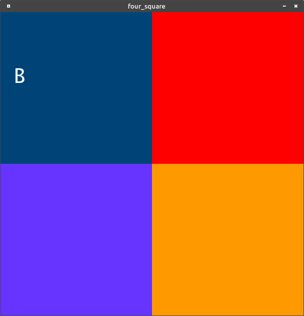</a>

## Chapter 5: Iteration and Randomness

<a href="chapter-5-iteration_and_randomness/concentric_circles">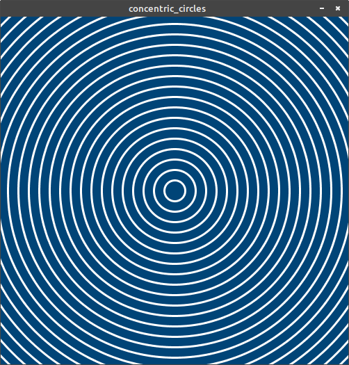</a> <a href="chapter-5-iteration_and_randomness/for_loop">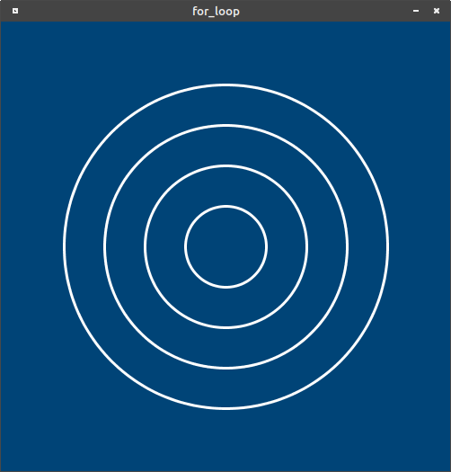</a>  <a href="chapter-5-iteration_and_randomness/random_functions">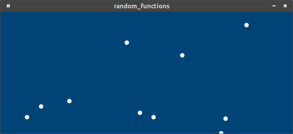</a> <a href="chapter-5-iteration_and_randomness/truchet_tiles">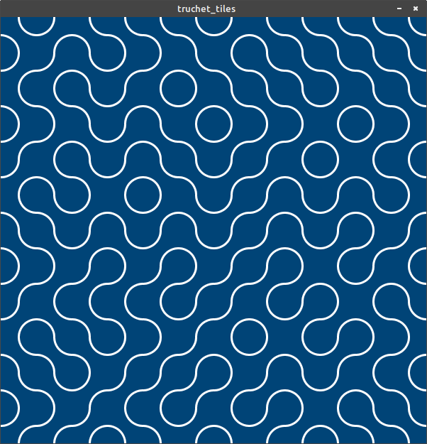</a>

## Chapter 6: Motion and Transformation

<a href="chapter-6-motion_and_transformation/perceiving_motion">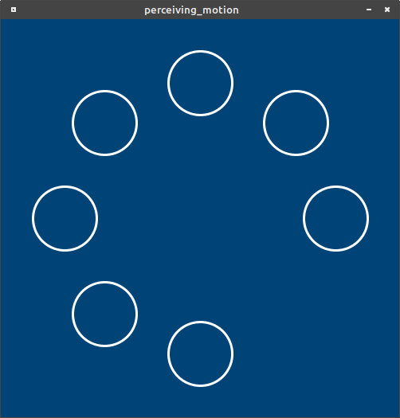</a> <a href="chapter-6-motion_and_transformation/global_variables">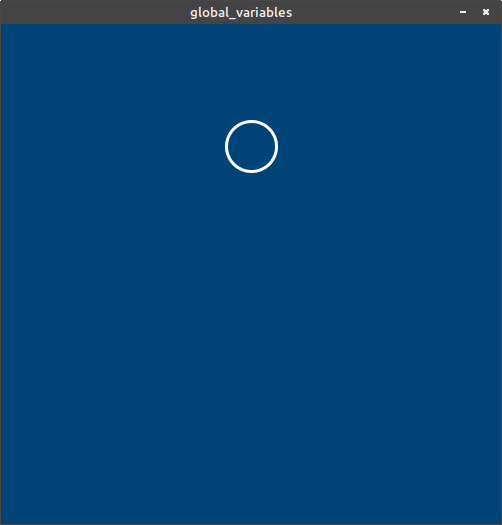</a> <a href="chapter-6-motion_and_transformation/dvd_screensaver">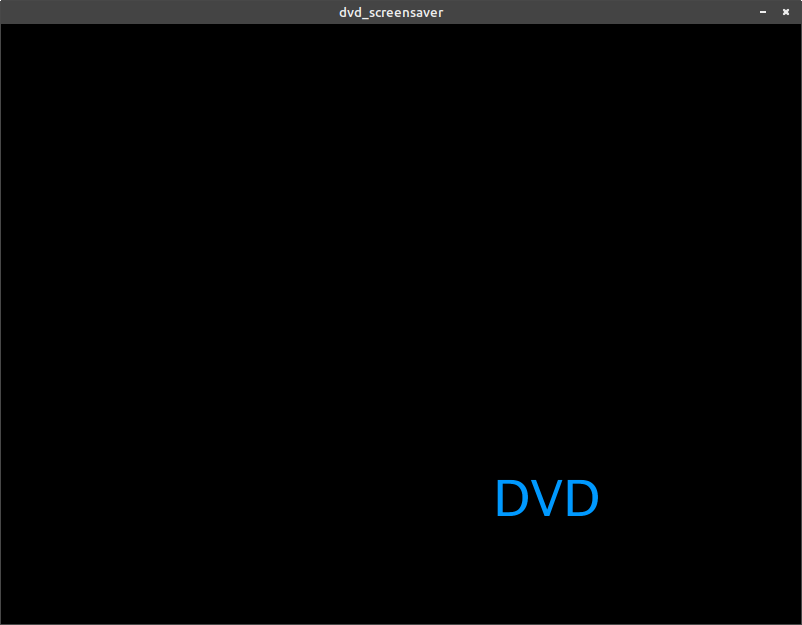</a> <a href="chapter-6-motion_and_transformation/transformation_functions">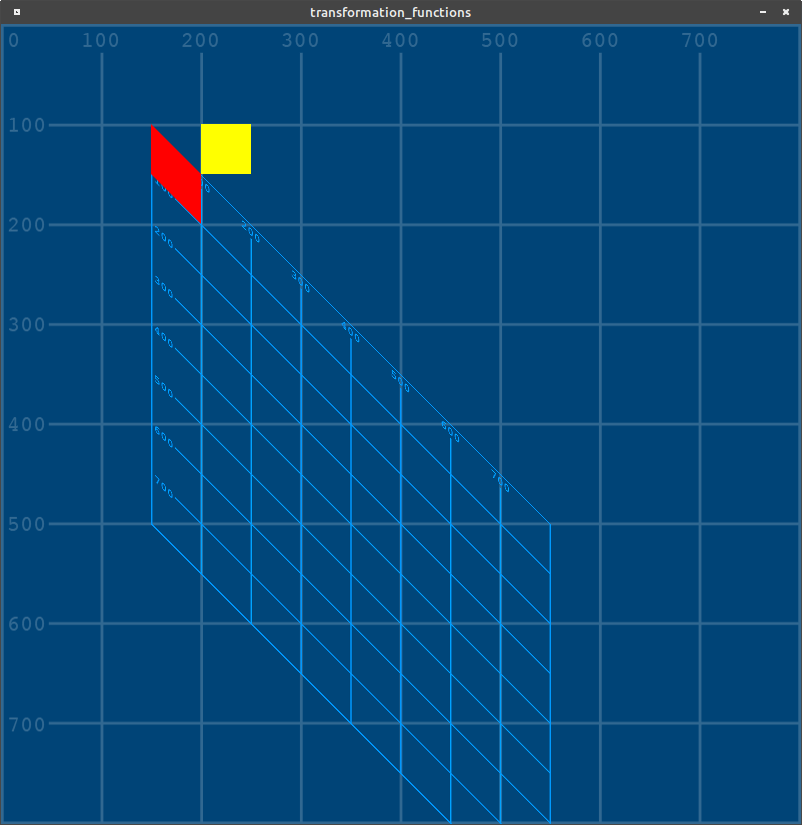</a> <a href="chapter-6-motion_and_transformation/analog_clock">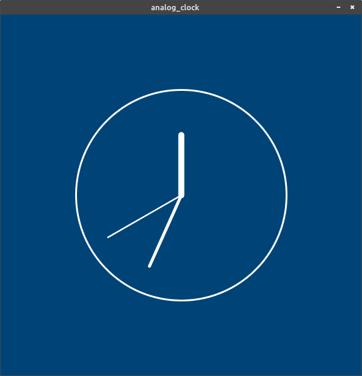</a>

## Chapter 7: Working with Lists and Reading Data

<a href="chapter-7-working_with_lists_and_reading_data/rainbow_list">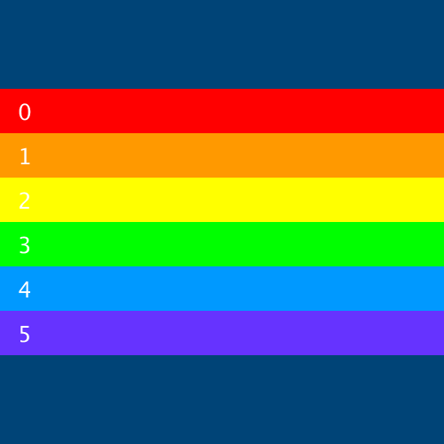</a> <a href="chapter-7-working_with_lists_and_reading_data/lists_of_lists">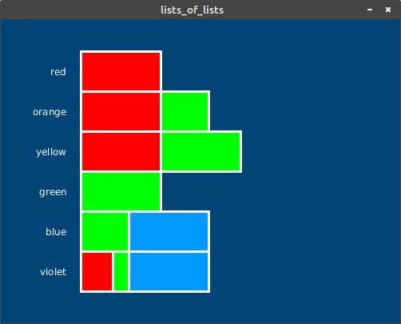</a>  <a href="chapter-7-working_with_lists_and_reading_data/csv">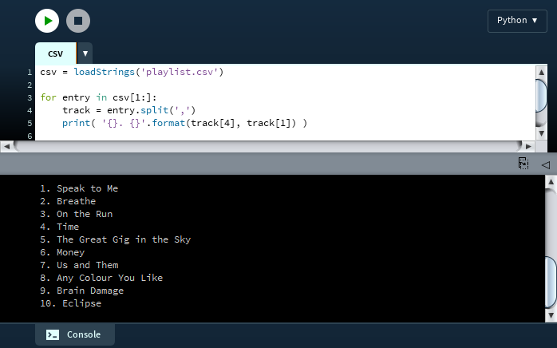</a> <a href="chapter-7-working_with_lists_and_reading_data/game_sales_chart">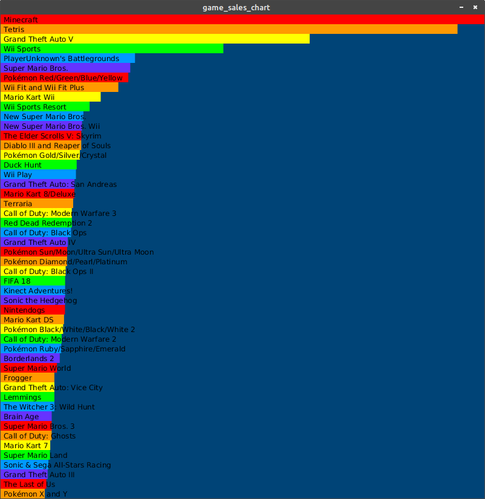</a>

## Chapter 8: Dictionaries and JSON

<a href="chapter-8-dictionaries_and_json/dictionaries">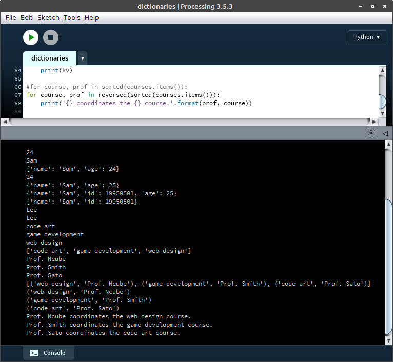</a> <a href="chapter-8-dictionaries_and_json/coffee_chart">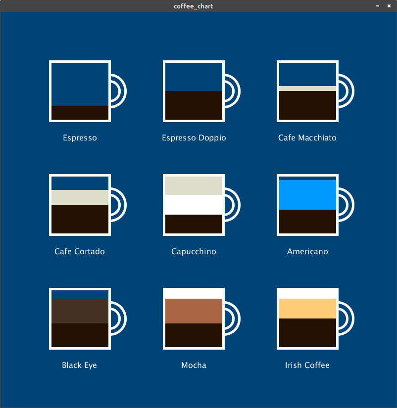</a>
