# Python Mode for Processing: Creative Coding Made Easy

The official source code for the examples, as well as solutions to challenges, for the book *Python Mode for Processing: Creative Coding Made Easy*.

## Chapter 1: Hello, World!

<a href="chapter-01-hello,_world!/hello_world">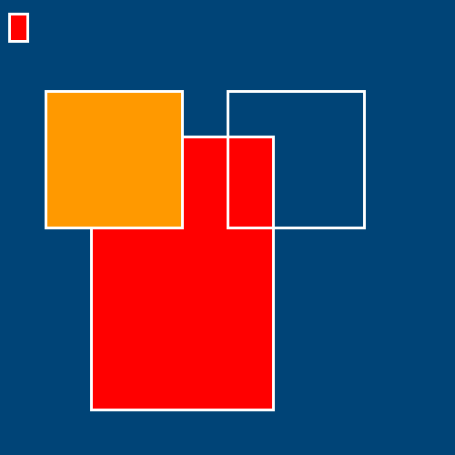</a>    

## Chapter 2: Drawing More Complicated Shapes

<a href="chapter-02-drawing_more_complicated_shapes/curves">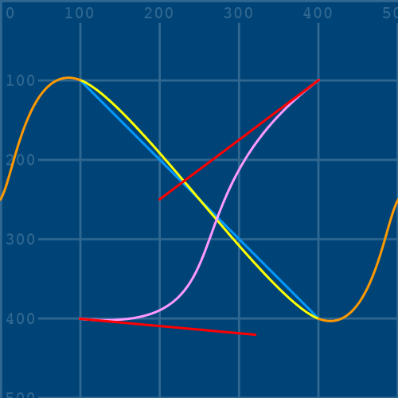</a> <a href="chapter-02-drawing_more_complicated_shapes/vertices">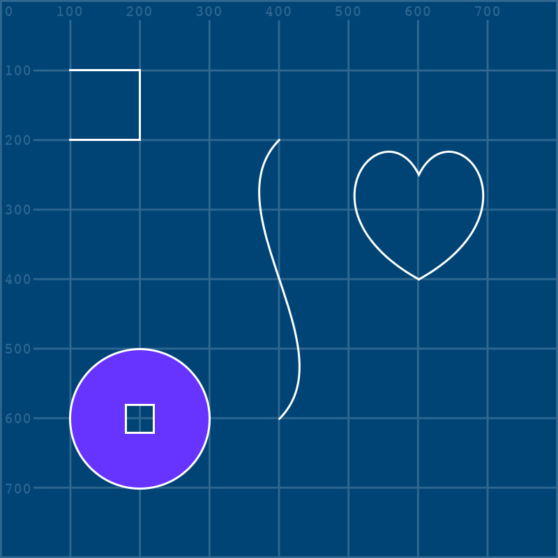</a> <a href="chapter-02-drawing_more_complicated_shapes/python_logo">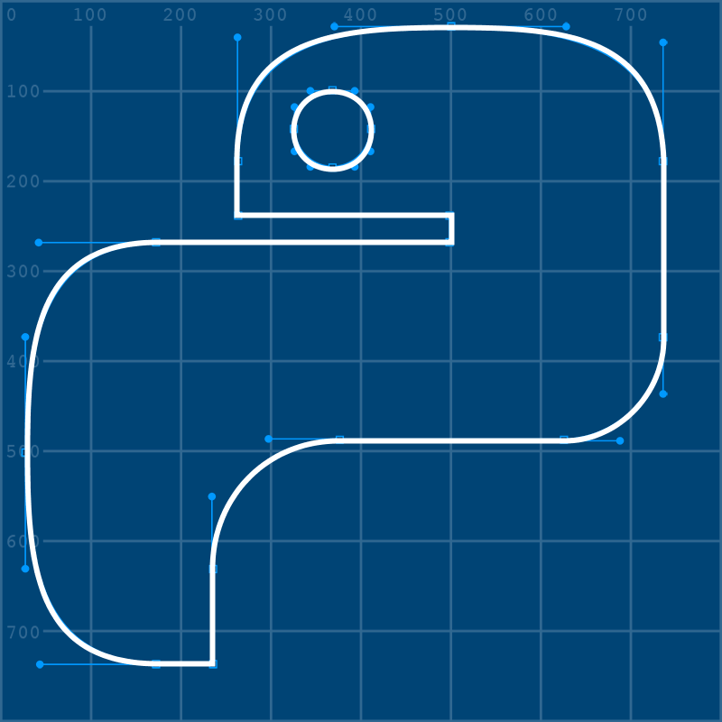</a>

## Chapter 3: Introduction to Strings and Working with Text

<a href="chapter-03-introduction_to_strings_and_working_with_text/strings">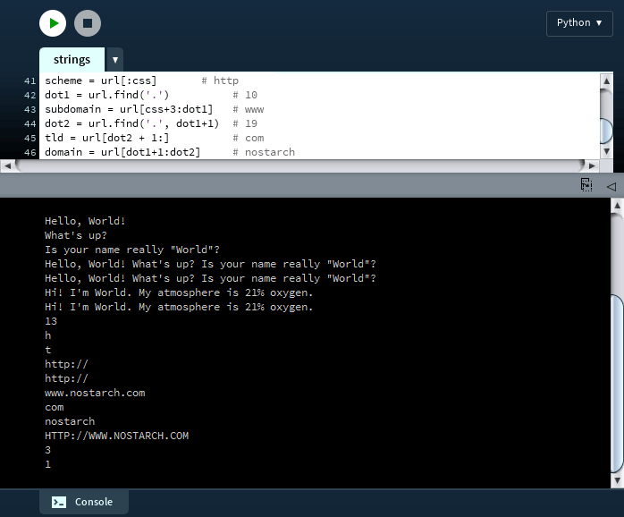</a> 

## Chapter 4: Conditional Statements

<a href="chapter-04-conditional_statements/conditional_statements">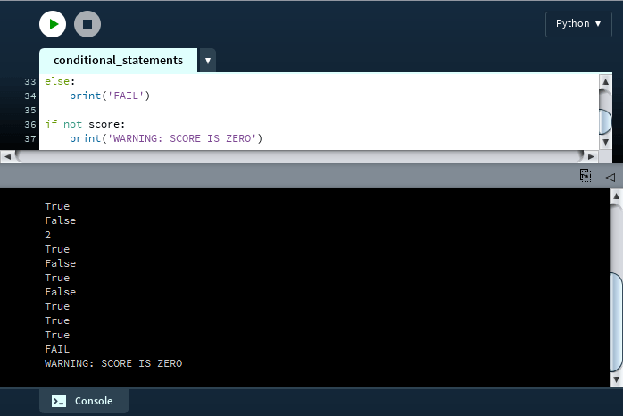</a> 

## Chapter 5: Iteration and Randomness

      

## Chapter 6: Motion and Transformation

    

## Chapter 7: Working with Lists and Reading Data

 <a href="chapter-07-working_with_lists_and_reading_data/lists_of_lists">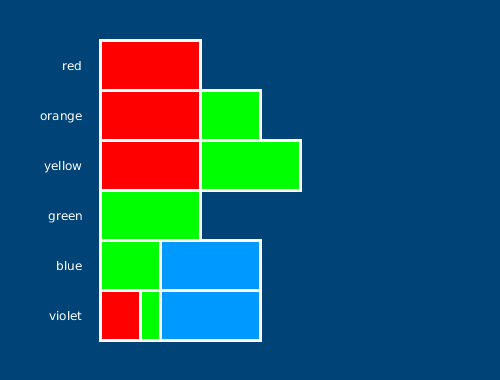</a>   <a href="chapter-07-working_with_lists_and_reading_data/game_sales_chart">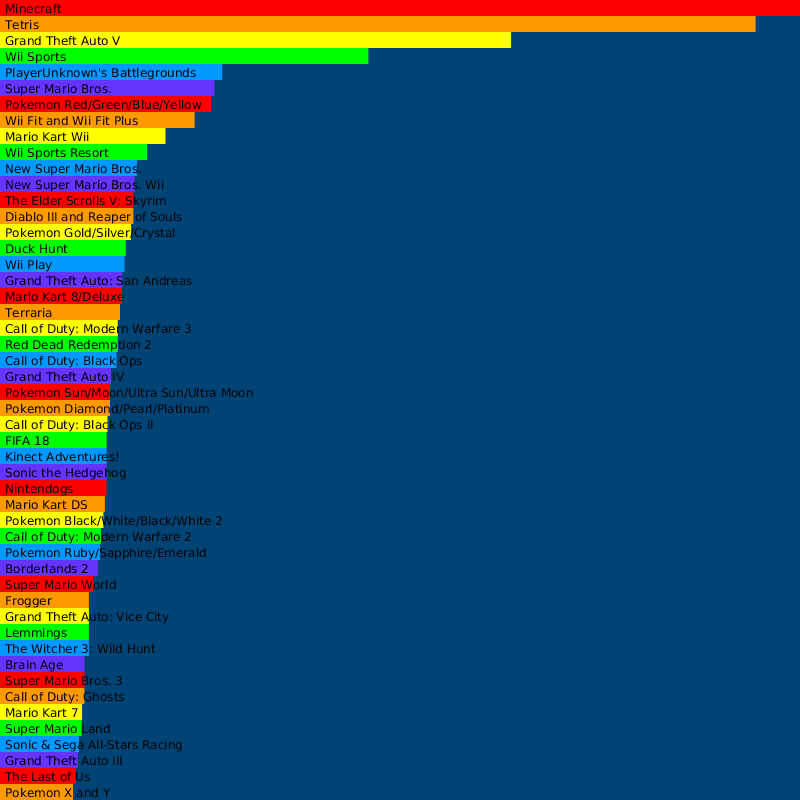</a>

## Chapter 8: Dictionaries and JSON

 <a href="chapter-08-dictionaries_and_json/coffee_chart">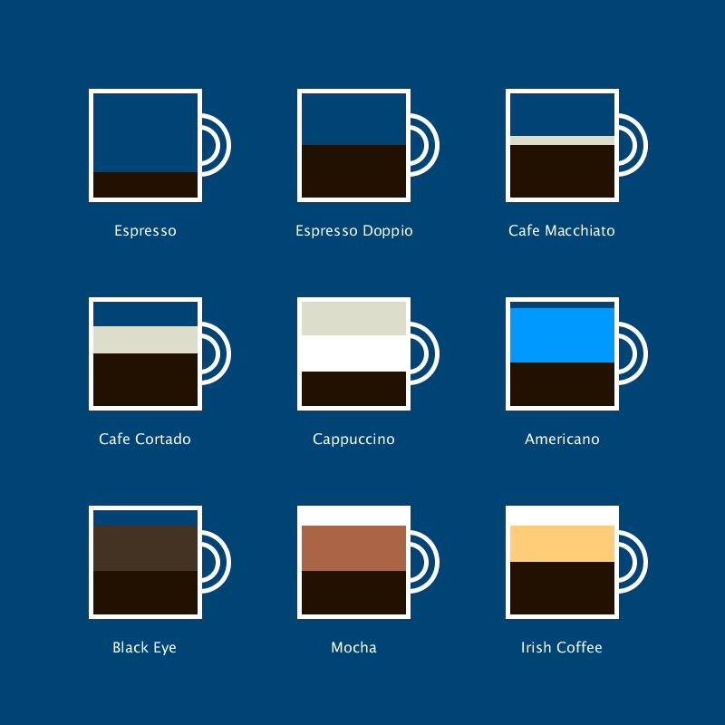</a>

## Chapter 9: Functions and Periodic Motion

  <a href="chapter-09-functions_and_periodic_motion/lissajous_curves">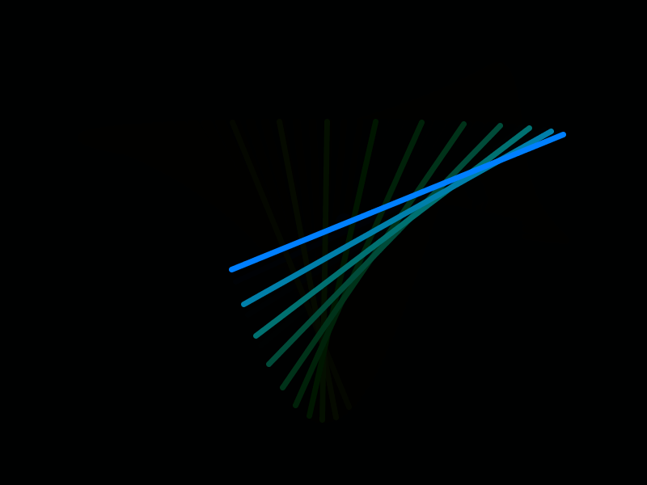</a>

## Chapter 10: Object-Oriented Programming and PVector

<a href="chapter-10-object-oriented_programming_and_pvector/microscopic">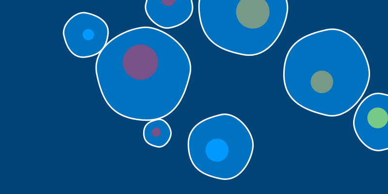</a>

## Chapter 11: Mouse and Keyboard Interaction

<a href="chapter-11-mouse_and_keyboard_interaction/scratch_art">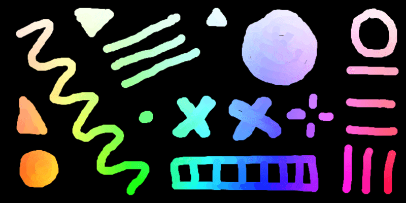</a> <a href="chapter-11-mouse_and_keyboard_interaction/paint_app">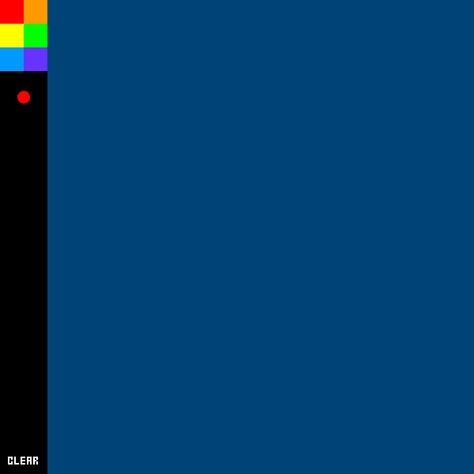</a>

## Miscellaneous

# Issues

If you find any issues, you can report them here: https://github.com/tabreturn/processing.py-book/issues. You can email the author at processingpy@tabreturn.com.
